<p align="center">
  <picture>
    <source media="(prefers-color-scheme: dark)" srcset="./docs/assets/brand/local-operator-icon-2-dark-clear.png">
    <source media="(prefers-color-scheme: light)" srcset="./docs/assets/brand/local-operator-icon-2-light-clear.png">
    
  </picture>
</p>

<h1 align="center">Local Operator Mobile</h1>

<p align="center"><i>Drive the Local Operator agent sessions running on your computer from your phone.</i></p>

<p align="center">
  <a href="./LICENSE"></a>
  <a href="https://github.com/damianvtran/local-operator-mobile/actions/workflows/ci.yml"></a>
  
  
</p>

<p align="center">
  <a href="https://github.com/damianvtran/local-operator">Agent backend</a> •
  <a href="https://github.com/damianvtran/local-operator-ui">Desktop app</a> •
  <a href="https://local-operator.com">Website</a>
</p>

> **Status: in development.** The app is built and exercised in this repository —
> against a mock relay, a frame audit and the test suite — but **no build has been
> published**: it is not in the App Store, TestFlight or Google Play, and no GitHub
> Release has been cut. [Features](#features) says what is built and what is not;
> [Download](#download) says what you can get today.

<br />

<p align="center">
  <picture>
    <source media="(prefers-color-scheme: dark)" srcset="./docs/assets/screenshots/session-view-dark.png">
    <source media="(prefers-color-scheme: light)" srcset="./docs/assets/screenshots/session-view-light.png">
    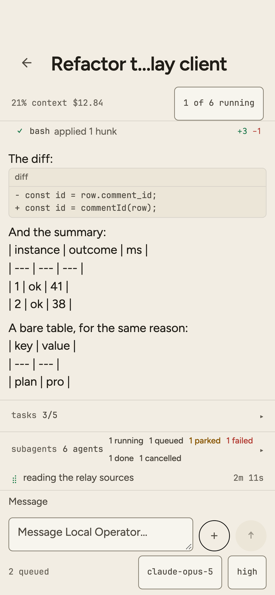
  </picture>
  <br />
  <sub><code>a session at work</code> — the transcript, the to-do and subagent strips, and the composer's model and effort chips.</sub>
</p>

## What it is

**Local Operator Mobile** is a native iOS and Android client for [Local Operator](https://github.com/damianvtran/local-operator) sessions that run on your own computer. Your agents keep running where they are — on your machine, with your files and your tools — and the app lets you follow along, answer questions, approve risky steps, and start new work while you are away from your desk.

It talks to the mobile relay that ships with Local Operator (`lop mobile`), the same relay behind today's mobile web client, and it is a native client for it: platform sign-in, and a layout designed for a phone rather than adapted to one. Push notifications are designed but not built yet — see [ADR 0006](./docs/adr/0006-push-and-ack-sync.md).

## Features

**Built** — each of these is implemented, unit-tested, and rendered against the
mock relay by the [frame audit](./docs/e2e/README.md):

- **Session list** — every live session on your computer, split into active and
  previous, with what each one is doing right now: which are running, how many
  subagents they have, which are waiting on you, and which have stopped answering.
- **Search** — filter the list, and search past sessions by their contents on the
  relay, not just their titles.
- **Live transcript** — follow a session as it works: messages, markdown, code
  blocks, diffs and tables, tool calls with their durations, images the agent
  produced, and results as they stream in.
- **Composer** — send a message, steer a running turn, or stop it, from one
  control that never moves; with the session's model and reasoning effort shown
  beside it, and a leading `/` for the session's own commands.
- **Approvals and questions** — approve or decline the steps an agent asks about
  and answer its questions, in the transcript where they were asked.
- **Subagents and to-dos** — the subagents a session has started (and a detail
  view for each), and the task list it is working through.
- **Image attachments** — send a photo or screenshot into a session.
- **New session, past sessions** — start a session in a folder you pick on your
  computer, with the model and an optional first prompt; and search earlier
  sessions and resume one.
- **Connection and sign-in** — sign in with Radient and the app finds your
  personal tunnels, or point it at any tunnel or URL you run yourself and sign in
  with the relay password. A tunnel that refuses, an expired login and a computer
  that is asleep each get their own explanation and remedy.
- **Settings** — the connected computer, appearance (theme and text size), and
  diagnostics for the connection.

**Designed, and not implemented yet:**

- **Push notifications** — the design for delivering a session's
  attention-needing events to the phone, and for acknowledging them across
  surfaces, is recorded in [ADR 0006](./docs/adr/0006-push-and-ack-sync.md).
  Nothing is wired up.
- **Demo mode** — a build that lets someone try the app without owning a computer
  running `lop`, which the store review paths in [`docs/publishing/`](./docs/publishing/)
  ask for.
- **Pair this phone** — setting the connection up by scanning something on the
  computer, instead of typing an address.

## How it connects

Local Operator's mobile relay runs on your computer and only listens locally. The app reaches it through a tunnel, and there are two ways to set one up:

- **Sign in with Radient** — sign in with your Radient account and the app finds your personal tunnels for you. The tunnel handles authentication, so you do not need a separate relay password.
- **Any tunnel or URL** — point the app at a tunnel or URL you run yourself, and sign in with your relay password.

To set up the computer side, see the Local Operator docs for [tunnels](https://github.com/damianvtran/local-operator/blob/main/docs/tunnels.md) and the [mobile relay](https://github.com/damianvtran/local-operator/blob/main/docs/mobile.md).

## Download

**No build has been published yet** — the app is in no store, and no GitHub
Release has been cut. Here is everything you can get today:

| Where | State today |
| --- | --- |
| **GitHub Releases** (signed APK, AAB and IPA) | No `v*` tag has been cut, so there is no Release to download. The release pipeline is in review in [#10](https://github.com/damianvtran/local-operator-mobile/pull/10); once it is on `main`, a `v*` tag runs the full gate, builds and signs both platforms, and attaches the artefacts to a Release. |
| **CI artefacts** | Once #10 is on `main`, every run that touches the native projects uploads a **debug APK** you can sideload and the **iOS simulator build plus the frame it rendered**; a push to `main` also uploads a **signed AAB and APK** to the `android-internal` artefact. |
| **Google Play** | **Not yet published.** `docs/publishing/google-play.md` lists what a listing requires. |
| **App Store** | **Not yet published.** `docs/publishing/apple-app-store.md` lists what a listing requires. |
| **TestFlight** | **Not yet published.** `docs/publishing/other-channels.md` covers the beta channel and its 90-day build expiry. |
| **Build it yourself** | `pnpm install` then `pnpm dev:web` — see [Development](#development). No Xcode or Android SDK is needed for the web target. |

Signing material (keystores, certificates, provisioning profiles) lives in CI
secrets only, never in this repository — and **none of it is configured yet**.
Both signed rows above are gated on it: the pipeline reads the Android keystore
and its passwords, the Play service account, and the Apple team id, App Store
Connect key id, issuer id and private key from repository secrets in a `release`
environment (`scripts/ci/check-secrets.ts --mode release`), and a `v*` tag fails
loudly — naming every variable that is missing — rather than skipping the
signing. A signed APK, AAB or IPA exists only once those are in place.

## Screenshots

Captured from the app's own web export (`pnpm export:web`), driven in installed
headless Chrome, against the mock relay in
[`tools/mock-relay/`](./tools/mock-relay/). Every frame is the app driven against
that relay's **fixture data**: the conversations, session names and model labels
are fixtures, not anyone's real sessions — and `nope/nope` in the session list is
the captured corpus's own placeholder label, sitting beside the realistic
`anthropic/claude-opus-5` that the synthetic fixtures carry. The light and dark
frames are the same cell with the theme overridden, and the session view and the
approvals card are the same screen in two of its states.

The frames are a 390 pt phone at 2× — 780 px wide, downsampled from a 3× capture.
The refusal pair is a 430 pt phone instead, which its 780 × 1691 shape confirms,
and the taller device is less a fix than a relocation: that screen's 34 pt
home-indicator inset ends its content viewport at 810 pt of 844 (898 pt of 932 on
the taller phone), so an uncropped frame of it always cuts whatever lands on that
line — the card heading `Create one on the computer` on the smaller phone, the
terminal block's last line on the taller one.

| Screen | Light | Dark |
| --- | --- | --- |
| **Welcome** — the first run, and the two ways in. | 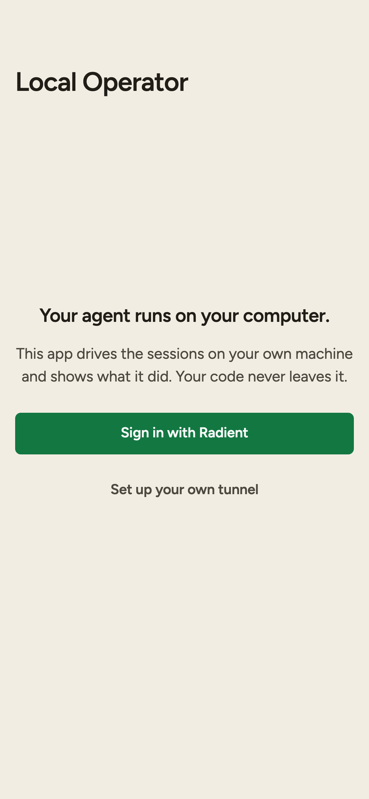 | 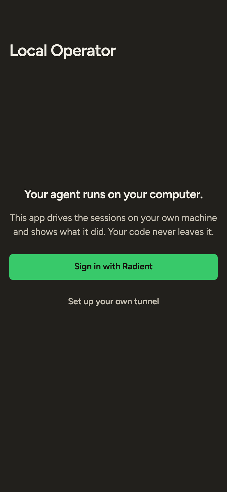 |
| **Sign in** — Radient, or an address and the relay password. | 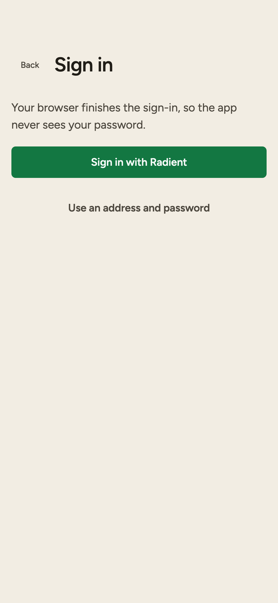 | 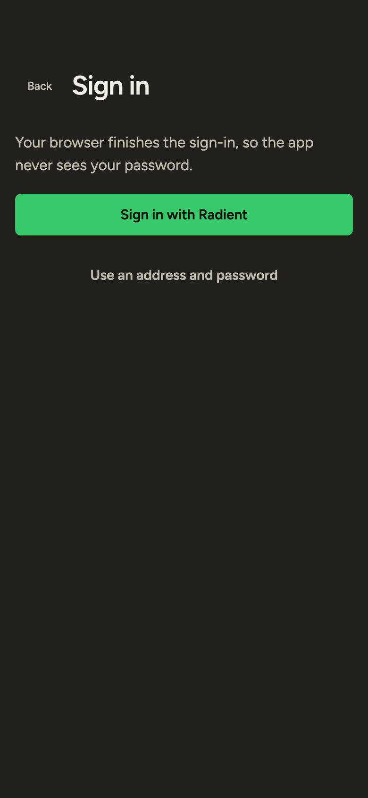 |
| **Session list** — active and previous, with what each one is doing right now. | 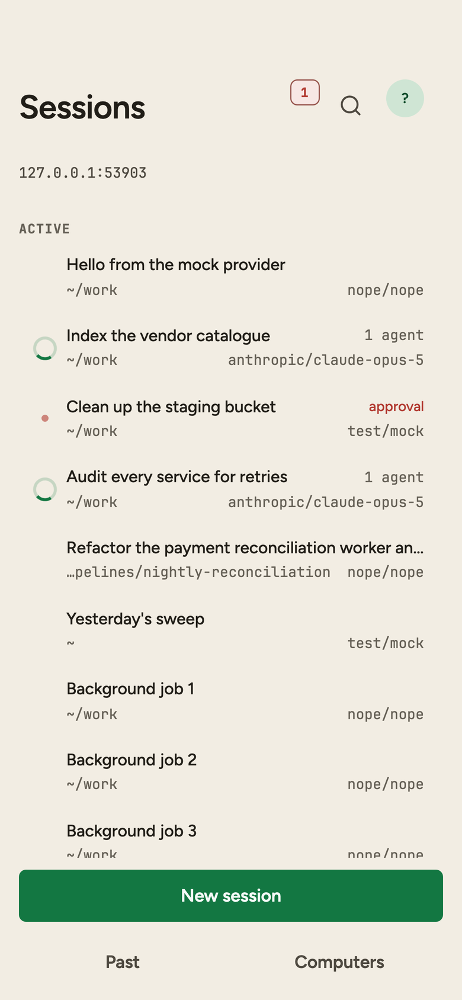 | 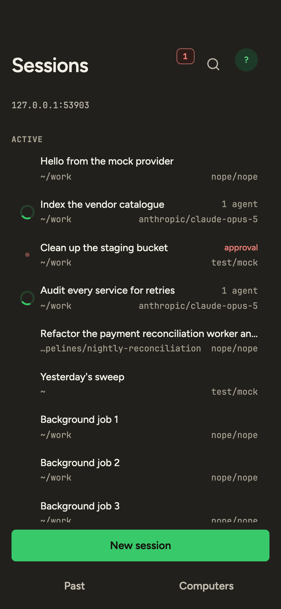 |
| **Session view** — the transcript, a running tool row, the to-do and subagent strips. |  | 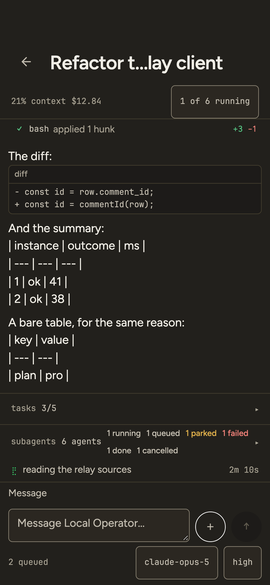 |
| **Approvals** — a step the agent wants to run, and the two ways to answer it. | 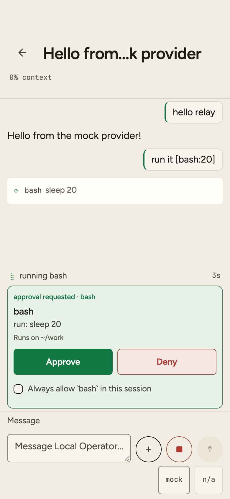 | 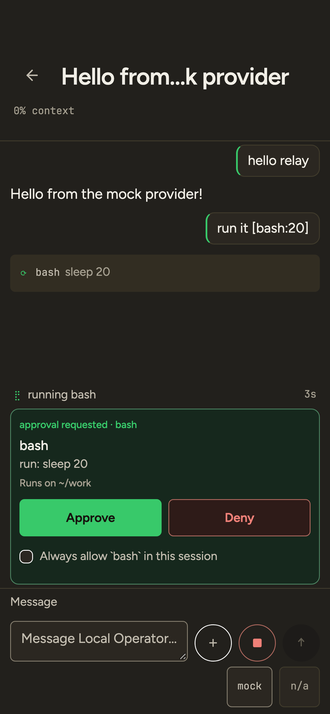 |
| **Settings** — the connected computer, appearance, diagnostics. | 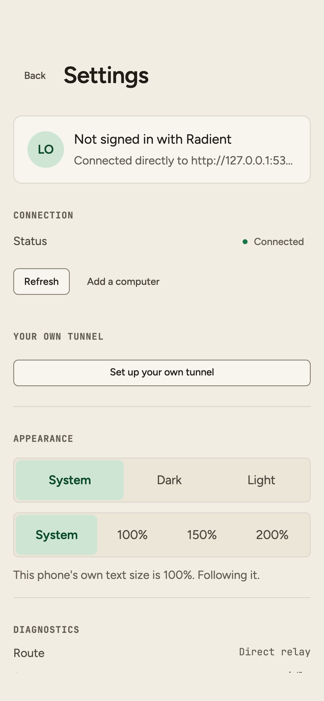 | 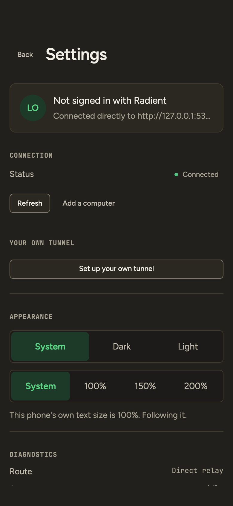 |
| **A refusal** — Radient refused the computer's relay authorization, and signing in on this phone will not change it. | 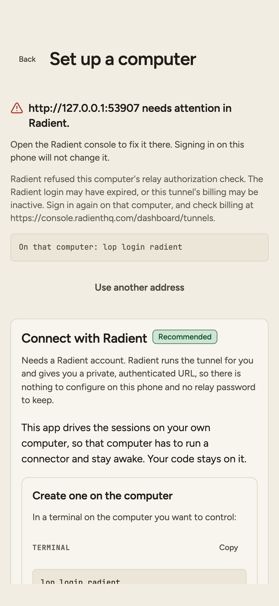 | 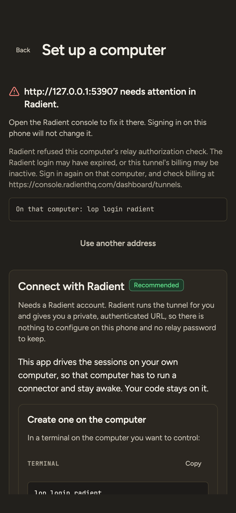 |

## Development

The app is **Expo / React Native** (SDK 57, React 19), typed with TypeScript,
styled through a generated design system, and tested with Vitest. The reasoning
behind the stack, the connection layer, the test harness and the pipeline is in
[`docs/adr/`](./docs/adr/) — starting with [ADR 0001](./docs/adr/0001-framework.md).

```sh
pnpm install        # pnpm only — the lockfile is pnpm's

pnpm dev            # the Expo dev server; press i / a for a device
pnpm dev:web        # the web target in a browser
pnpm ios            # or: pnpm android

pnpm test           # vitest, Node environment
pnpm typecheck      # tsc --noEmit, app and tools
pnpm lint           # biome check
pnpm theme:check    # the generated styling layer is current with the tokens
pnpm contrast:check # the design kit's contrast contract still holds
pnpm export:web     # writes dist/, which is also what the frame audit drives
```

The end-to-end and design-audit layers have their own entry points — the mock
relay, the frame harness and the audit checker, all plain Node with no
dependencies:

```sh
pnpm mock:relay             # the deterministic mock relay, any state on demand
pnpm audit:capture          # serve dist/, drive headless Chrome, write a frame matrix
pnpm audit:run              # score those frames against the audit rubric
pnpm e2e:verify             # the tools' own types, this page's commands, the relay
                            # contract, and the divergence checks
```

See [docs/development.md](./docs/development.md) for the loops, and
[docs/e2e/README.md](./docs/e2e/README.md) for what the harness can and cannot
prove. Native builds and native end-to-end tests run in CI: nothing here needs a
local Xcode or Android SDK.

See [CONTRIBUTING.md](./CONTRIBUTING.md) for how changes are proposed and reviewed, and [AGENTS.md](./AGENTS.md) for the conventions humans and coding agents follow in this repository.

## Documentation

The documentation index is [docs/README.md](./docs/README.md):

- [`docs/adr/`](./docs/adr/) — architecture decision records: the framework and
  styling stack, connection and authentication, the e2e and audit harness, the
  CI/CD pipeline, queued asks, and push notifications with cross-surface acknowledgement.
- [`docs/relay/`](./docs/relay/) — the relay contract the app is written
  against, its types, its feature map and the tunnel edge.
- [`docs/e2e/`](./docs/e2e/) — the mock relay, the frame harness and the audit
  checker, and what each one can prove.
- [`docs/ux/`](./docs/ux/) — user experience research, the target flows,
  principles, and the audit rubric the frames are scored against.
- [`docs/design/`](./docs/design/) — the design system the app's styling layer is
  generated from: brand kit, components, tokens and previews.
- [`docs/publishing/`](./docs/publishing/) — what the App Store, Google Play and
  the other channels each require, and the checklist that tracks them.
- [`design/`](./design/) — the design and brand kit the styling layer is generated from.
- [`store/`](./store/) — draft store listing copy in the layouts fastlane expects.

## Security

The app is a remote control for agents that can run code on your computer, so security reports are taken seriously. Please report vulnerabilities privately as described in [SECURITY.md](./SECURITY.md) — not in a public issue.

## License

This project is licensed under the MIT License — see the [LICENSE](./LICENSE) file for details.
