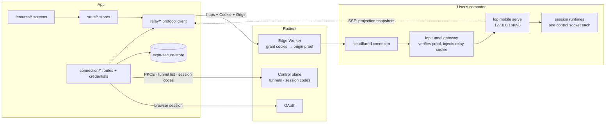

# Architecture

How the mobile app is put together, and why. This document is the
map; the decision records in [`docs/adr/`](./adr/) are the reasoning, and the
relay's own contract is defined in the Local Operator repository
([`docs/mobile.md`](https://github.com/damianvtran/local-operator/blob/main/docs/mobile.md),
[`docs/tunnels.md`](https://github.com/damianvtran/local-operator/blob/main/docs/tunnels.md)).

**Status:** design. Nothing here is implemented yet; where a module name appears, it
is the agreed shape to build, not a file that exists.

**Provenance.** This document cites documents, vendor pages and file paths rather
than code lines; where it names a file in a code repository, the revision convention
is the one stated in [ADR 0002](adr/0002-connection-and-auth.md) — local-operator
`fc851a94e`, agent-server `dcafe852`, user-console `8597fdba`, expo
`500d25dea3746c8ceeb751b3c55f432b269be410` — resolved with `git show <ref>:<path>`
(or the GitHub contents API for expo), never from a working tree.

## What the app is

A phone-sized remote control for agent sessions that run on the user's own
computer. The computer runs `lop mobile serve` (loopback only) and, in the
recommended setup, a `lop tunnel` connector that publishes it through a Radient
personal tunnel. The app is a client of that relay: it lists sessions, renders the
live transcript, steers turns, answers approvals and questions, drills into
subagents, and starts new sessions.

The important architectural consequence is that **the app owns almost no domain
logic**. The relay is the authority for session state; the app's job is to
authenticate, transport, render, and keep its view honest across a stream that is
deliberately cut every 60 seconds.

## Principles

1. **The relay is the source of truth; the app is a projection cache.** Every push
   is a full snapshot with a monotonic `version`, so there is no merge logic and no
   delta protocol to drift (`relay types`, `SessionProjection`).
2. **Stale beats blank.** A dropped stream keeps the last good projection on screen
   and marks it stale; it never empties a transcript the user was reading.
3. **Uncertainty is explicit.** A command whose delivery is unknown is persisted
   with its UUID and replayed with the same UUID, never silently retried as a new
   instruction (retry envelope, `docs/mobile.md` §"Retry-envelope").
4. **Secrets live in the platform keystore, in one module.** No screen reads a token;
   one connection module does.
5. **No raw colours, no raw spacing.** Every visual value comes from the design kit's
   tokens, generated into the styling layer.
6. **One route at a time.** A *route* (Radient tunnel or custom URL) is a connection
   profile; the UI and the relay client do not know which one is in use beyond a
   header policy.

## Module layout

```
app/                                  # Expo Router routes — navigation only
  _layout.tsx                         # providers: theme, connection, toasts
  (auth)/welcome.tsx                  # first run: what this is, connect
  (auth)/sign-in.tsx                  # Radient browser sign-in
  (auth)/tunnels.tsx                  # pick a computer (or "set one up")
  (auth)/custom.tsx                   # URL + relay password
  (app)/index.tsx                     # sessions list
  (app)/session/[id].tsx              # session view (transcript + composer)
  (app)/session/[id]/agent/[jobId].tsx# subagent view
  (app)/past.tsx                      # past sessions + search
  (app)/new.tsx                       # new session (directory picker)
  (app)/settings.tsx                  # connection, theme, diagnostics, sign out

src/
  contracts/                          # relay wire contract (see "Type sharing"; wire samples in fixtures/relay/)
    schemas.ts                        # zod schemas for every payload
    types.gen.ts                      # hand-authored mirror of the relay's dataclasses
  relay/                              # the protocol client — no UI, no navigation
    endpoints.ts                      # one function per relay route
    http.ts                           # fetch wrapper: headers, origin, errors
    sse.ts                            # streaming reader + framer + reconnect
    errors.ts                         # HttpError, EdgeRefusal, RelayRefusal
    retry-envelope.ts                 # UUID-scoped command delivery
  connection/                         # routes, identity, and credentials
    profile.ts                        # RouteProfile: radient | custom
    radient-oauth.ts                  # PKCE sign-in (loopback listener)
    tunnel-session.ts                 # mint, refresh, re-mint, revoke
    discovery.ts                      # GET /v1/tunnels → computers and harnesses
    client-factory.ts                 # RouteProfile → configured relay client
    storage.ts                        # expo-secure-store reads/writes
  notifications/                      # push registration, badges, deep links
                                      # (ADR 0006 "Push notifications and
                                      # cross-surface acknowledgement")
  state/                              # zustand stores (no React in here)
    connection-store.ts               # profile, session, connection health
    list-store.ts                     # sessions list (from list SS E)
    projection-store.ts               # per-session projections (from SSE)
    ui-store.ts                       # theme, text scale, sheets, toasts
  features/
    sessions/                         # list screen composition
    session/                          # transcript, composer, cards
    agent/                            # subagent composition
    past/  new-session/  settings/
  ui/                                 # the design system
    theme.css                         # generated from design-kit tokens.json
    components/                       # vendored, MIT: button, sheet, card, …
    a11y.ts                           # identifiers + roles as constants
  lib/
    format.ts  time.ts  markdown.ts   # pure helpers (unit-tested)
```

The boundary that matters: **`src/relay/` and `src/connection/` never import from
`src/features/` or `app/`**, and never touch `expo-secure-store` directly except
through `connection/storage.ts`. That keeps the protocol testable in Node and makes
the mock relay (ADR 0003) usable from both unit tests and the web target.

## State management

Three concerns, three stores, one rule each:

| Store | Holds | Rule |
|---|---|---|
| `connection-store` | active route, Radient identity (label only), tunnel session summary, connection health (`connecting \| live \| degraded \| refused \| signed-out`) | the only place that can start or end a route |
| `list-store` | `SessionSummary[]` from `/api/sessions/events` | replaced wholesale on each push |
| `projection-store` | `Map<sessionId, {projection, connected, awaitingSnapshot}>` | accepts a frame only if it is the first of a connection or newer than what it holds |

Why not a data-fetching library: the interesting state is *streamed snapshots*, not
request caches, and the relay's own web client proves the hand-rolled store works at
this size (`~/local-operator/local_operator/mobile/web/src/store.ts`). Zustand is
the same choice the desktop app and the site already made. If a request-caching
concern appears later (past-session search paging is the likely one), add TanStack
Query beside the stores for *that* concern only — do not move projections into it.

### Connection state machine

```
signed-out ──sign-in──▶ discovering ──pick computer──▶ minting ──▶ live
     ▲                                                              │
     │                                           60 s stream cut ───┤ (transparent)
     │                                                              │
     ├── refresh handle expired (30 d) or OAuth lapsed ◀── re-minting
     │                                                              │
     └── user signs out ◀── refused (503 reason) ◀──────────────────┘
```

`degraded` is a UI state, not a transport state: the relay reports a session whose
runtime socket is unreachable but whose record is fresh, and those rows render
differently from `ended` ones (`~/local-operator/docs/mobile.md`, "The control
socket").

## Navigation map

```
welcome / sign-in ─▶ computer picker ─▶ sessions list ─┬─▶ session view ─┬─▶ subagent view
        │              │                              │                 └─▶ sheets: model,
        └─ custom URL ─┘                              ├─▶ past sessions ──▶ resume ──▶ session view
                                                      ├─▶ new session ──▶ session view
                                                      └─▶ settings
```

Sheets rather than screens for the model picker, effort, slash commands, and the
connection switcher — they are decisions *inside* a session, and the transcript must
stay behind them. Approvals and questions are not sheets: they are pinned cards above
the composer, because they block the agent and must be visible without a gesture
(`pending` / `pending_count` in the projection, including the "1 of N" case for a
parallel tool batch).

## Data flow



A steering command, end to end — the shape every mutation has:

```mermaid
sequenceDiagram
  participant U as User
  participant S as projection-store
  participant R as relay client
  participant E as Edge Worker
  participant G as Gateway
  participant D as Relay daemon
  participant X as Session runtime

  R->>E: GET /api/sessions/{id}/events (SSE, Cookie, Origin)
  E->>G: forward + origin proof
  G->>D: loopback + injected relay cookie
  D-->>R: event: projection {version: 41, streaming: true}
  U->>S: type instruction, send
  S->>R: POST /api/sessions/{id}/command (UUID envelope)
  R->>E: POST (+ Origin)
  E->>G: forward
  G->>D: forward
  D->>X: prompt frame (deduplicated by UUID)
  D-->>R: 2xx receipt
  X-->>D: delta frames
  D-->>R: event: projection {version: 42}
  Note over R,D: 60 s later the gateway lease ends the stream; the client reopens and resyncs on the next snapshot
```

## Type sharing with the relay contract

The relay serialises Python dataclasses with `asdict`, and the existing web client
mirrors them by hand with a comment saying so
(`~/local-operator/local_operator/mobile/web/src/types.ts`, first paragraph). Two
hand-maintained mirrors is one too many, so this repository runs two mechanisms
against the wire instead:

1. **Mirror by hand, seeded from the contract.** `src/contracts/types.gen.ts` is
   the field-for-field mirror of the relay's dataclasses, seeded from
   `docs/relay/types.ts` — the annotated reading of the same wire, which carries the
   `file:line` citations. It is **hand-authored and committed on purpose**, so a
   contributor without a local-operator checkout can still build. A generator
   (`scripts/gen-relay-types.mjs`) that would read the relay's dataclasses — given a
   path to a Local Operator checkout, or a published wheel — and emit this file
   field-for-field, defaults included, is **planned, not present**; so is the
   scheduled CI job that would regenerate it and fail on drift.
2. **Validate at the boundary, always.** `src/contracts/schemas.ts` holds a zod
   schema per payload, and the relay client parses every REST body and every SSE
   frame through it. Unknown fields are preserved rather than stripped, so a newer
   relay can add a field and an older app keeps working; a *missing* field falls back
   to the documented default rather than rendering `undefined`. This is the mechanism
   that makes the relay's additive-only evolution rule (`docs/mobile.md`) safe on the
   client side.
3. **Hold the two files together at compile time.** `WireConformance` in
   `src/contracts/schemas.ts` is a type-level assertion that each schema it covers
   produces a shape assignable to the mirror's declaration: a schema that answers
   `undefined` where the wire promises a string, or that widens an enum, fails
   `pnpm typecheck`. It fires for the asserted subset — 20 of the 28 registered
   schemas. The eight it does not yet cover (`commandOp`, `gatewayRefusal`,
   `modelEntry`, `projectionStreamFrame`, `resumeSession`, `sessionsStreamFrame`,
   `startSession`, `subagentRow`) are request bodies, stream frames and element
   shapes outside the assertion; five of them already have a mirror type, so the
   gap is coverage rather than a missing declaration. That, with the boundary
   validation above, is the mirror's real mechanical guard today — not a generated
   file checked for drift, but a hand-authored one the parser and the compiler keep
   honest.

The generator and the CI drift-check are named above as *planned* because the web
client's parity story has them and this repository does not yet: `docs/ci.md`
records the fixture re-capture diff as a deliberate non-goal until the script
exists, and the wire corpus it would re-capture lives at `fixtures/relay/`. When
the drift-check lands it should be **non-blocking on failure but alerting**,
because the relay may legitimately move ahead of the app; the app's own CI is not
the place to hold a different repository hostage.

Compatibility signals we do read at runtime:

| Signal | Use |
|---|---|
| `GET /healthz` → `{ok, version, sessions, dist}` | server identity and liveness before subscribing; `version` is the relay's `PROTOCOL_VERSION` |
| `projection.version` | ordering within an epoch; a lower number after reconnect is dropped |
| `projection.attention` / `pending_count` | unread verdicts and "1 of N" approvals |
| `X-Radient-Login` header and the gateway's `{reason}` on 503 | error taxonomy (ADR 0002, §4) |

An unrecognised `reason`, an unknown `entryKind`, or an unknown `pending` shape must
render as a *generic but honest* row ("Something new from your computer — update the
app to read it") rather than crash or vanish; the web client already models this
pattern with an unknown-kind path.

## Lifecycle

- **Cold start:** restore the route profile → validate the tunnel session → open the
  list stream → render. Nothing blocks the first frame on a network call: the last
  known session list is rendered from cache, marked stale, and corrected by the first
  push.
- **Foreground/background:** streams are closed when the app is not visible and
  reopened on resume with a fresh snapshot. The 60-second gateway lease makes
  "long-lived stream" an illusion anyway, so there is nothing to keep alive in the
  background. The background case — including that a self-hosted route gets no
  alert at all — is decided in [ADR 0006](adr/0006-push-and-ack-sync.md) §2
  (which settles ADR 0002 §7 **S5**).
- **Route switch:** ending a route aborts in-flight requests, closes streams,
  clears the projections (they belong to a different computer), and keeps only what
  the user explicitly saved.
- **Session change:** the app drops the projection cache for a session the relay
  reports as superseded (a new epoch) rather than trying to reconcile.

## Performance

- The transcript renders a bounded tail; older entries load on scroll through
  `/api/sessions/{id}/history` and `/agents/{jobId}/history`, never by growing the
  live projection.
- Tool rows are collapsed by default and expand on demand; diffs render from the
  relay's pre-computed counts (`green/red` counts in the projection), not by diffing
  text on the phone.
- Markdown is tokenised once per entry and memoised by entry id; streaming text is
  rendered as cheap paragraphs and re-tokenised on turn end, so a streaming
  transcript is not re-parsing markdown 20 times a second.
- Images are fetched lazily from `/api/sessions/{id}/image` and never carried in the
  projection.

## Open questions

| # | Question | Owner / trigger |
|---|---|---|
| 1 | ~~Push notifications (APNs/FCM) — the relay has none today (`docs/mobile.md`, "Non-goals (v1)")~~ **Answered:** the design is [ADR 0006](adr/0006-push-and-ack-sync.md) — push on the Radient route, no push on a self-hosted one, unread state staying on the machine | The relay-side and cloud-side slices are in [`docs/push-plan.md`](push-plan.md) |
| 2 | Answering approvals on *terminal* sessions — the relay deliberately refuses today | Relay contract change; the app should render the "answer at the terminal" state faithfully until then |
| 3 | Sending images (the relay serves them, does not accept them) | Depends on the relay's upload path |
| 4 | Tablet and foldable layouts | Design work after the phone layout is settled; the routing model already supports it |
| 5 | A web/PWA build on the same codebase | The web target exists for testing (ADR 0003); publishing it is a separate product decision |
| 6 | Localisation | Not in v1; keep copy out of components in one catalogue so it stays cheap |
