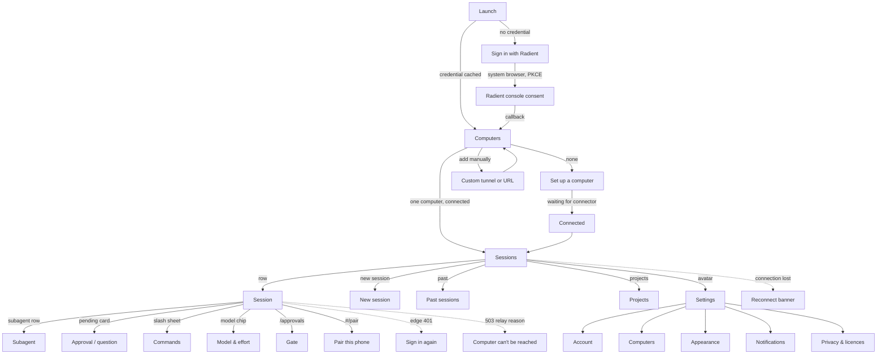

# Target native flows

Step-by-step specs for the Local Operator mobile app: every state a screen can be
in, what the user can do, and the *intent* of the copy (exact strings are the
designer's to finalise; the intent and the facts each string must carry are
fixed here). Flows are ordered as a user meets them. `F-n` ids are referenced by
`principles.md` and by the audit harness.

Conventions used below:

- **State:** every non-happy state is named. A flow is not specified until its
  loading, empty, error and degraded states are.
- **Copy intent:** what the sentence must convey, in the Local Operator voice
  (`~/local-operator-site/docs/design-kit/voice.md`): say what happens and on
  whose machine, no jargon noun, no adjective doing a verb's job, one idea per
  sentence.
- **Facts available:** the relay/edge facts each screen may state, so copy can be
  specific instead of generic. Sources: `docs/mobile.md`, `docs/tunnels.md`,
  `local_operator/tunnels/gateway.py` (`RELAY_DETAIL`), the Radient edge
  (`edge/tunnel-worker/src/index.ts`) and control plane
  (`internal/tunnels/{service,model}.go`).

## 0. Navigation map

Screen names (final): **Computers** (host list), **Sessions** (session list),
**Session**, **Subagent**, **New session**, **Past sessions**, **Projects**,
**Settings**, **Set up a computer**, **Sign in**.

## 1. F-1 First run → signed in → connected

Steps:

1. **Launch, no credential.** Show the brand mark and one sentence about what
   the app is for. One primary action: *Sign in with Radient*. One secondary,
   smaller: *I have a tunnel address and password* (F-3). Nothing else.
   - *Copy intent:* name the account ("Radient") and what signing in does (finds
     your computers). No feature tour, no three-panel onboarding — the product
     reveals itself in the list.
2. **Sign in (system browser, never an in-app web view).**
   `ASWebAuthenticationSession` (iOS) / Chrome Custom Tabs (Android). PKCE S256,
   scope `openid profile email offline_access`, loopback or app-link callback.
   **Constraint:** Google/Microsoft sign-in is the console's only route, and
   embedded WebViews are refused by Google, so an embedded web view is not an
   option — this is why the flow is a browser sheet.
   - *States:* browser open / user cancels / callback received / callback fails.
   - *Copy on cancel:* "Sign-in was cancelled." + *Try again*. Never scold.
3. **Post-sign-in handshake.** Exchange the code, store the refresh token in the
   **keychain/keystore** (never in app storage), then discover tunnels
   (`GET /v1/tunnels` with the Bearer token).
   - *States:* discovering (brief) / one computer / several / none / discovery
     error. On error, do not dump a status code: "We couldn't check your
     computers just now." + *Retry* + *Use an address instead*.
4. **Zero computers** → F-2. **One or more** → F-4 Computers.
5. **Later launches:** cached credential + last computers → straight to
   Computers with the previous list rendered from cache (age shown if > 5 min,
   see F-4).

Copy intent for the button: it is an action on their account, so say what they
get: *Sign in with Radient* is right; "Continue with…", "Authorize", "Connect
account" are not.

## 2. F-2 No tunnel yet → the one command → live wait → connected

This is the highest-leverage flow in the product: today a user who has signed in
but has no tunnel hits a dead end.

1. **Empty Computers screen.** Title *Set up a computer*. One paragraph: this
   app drives the Local Operator sessions on your own computer; the computer has
   to run a connector and stay awake. *Copy intent:* "your computer", "stays
   awake and connected", "your code stays on it". No metaphor, and the word
   "tunnel" does not appear in the first sentence.
2. **Two ways, one screen, one recommended.**
   - **(a) Command to run on the computer** — the short command
     `lop tunnel connect` (after `lop login radient`), shown in a monospace block
     with a *Copy* button. Plus the TUI alternative, `/mobile enable`, for
     people who live in the terminal.
   - **(b) "I already have a tunnel"** → F-3.
3. **Live wait for the connector.** Immediately after the copy, the screen
   switches to a waiting state that actually polls the tunnel's status through
   the Radient control plane (owner token). This is the state that must not be a
   dead end.
   - *States:* waiting / **connector seen, not yet authorized** / connected /
     timed out (2-3 min) / user backgrounded the app.
   - *Waiting copy:* "Waiting for `<computer name>` …" plus a live line naming
     the last thing observed: "Not seen yet", "Connector connected — finishing
     setup", "Ready".
   - *Success:* flip to the Computers list with the new computer, then straight
     into F-4's connected state (if it is the first computer, go to F-5).
   - *Timeout copy:* keep the command visible (the user may still be typing it),
     add "We haven't seen your computer yet. It needs to stay awake and online."
     and a *Check again* button.
4. **Billing / eligibility gating.** The control plane reports connector-level
   facts we can surface honestly (`internal/tunnels/service.go` billing status:
   `active`, `eligible`, `monthly_price_usd`, `balance_usd`, `amount_due_usd`;
   tunnel status: `pending`, `active`, `disabled`, `suspended`, `revoking`,
   `reconciling`, `error`, `deleted`):
   - `pending`: "Almost ready — finish setting up in the Radient console." +
     *Open console*.
   - `suspended` / balance at the floor: state the amount due and the one
     action: "This tunnel is suspended. Add `<amount>` of credit in the Radient
     console to turn remote access back on." + *Open console*. **Never** say
     "billing error"; **never** activate anything silently (matches
     `docs/tunnels.md`: "Billing is never activated silently").
   - `disabled`: "Remote access is switched off for this tunnel." + *Open
     console*.
   - `error`: "Radient couldn't finish setting this tunnel up." + *Open console*.
   - Not eligible (no positive credit at first setup): say what is missing and
     that the console is where credit lives; do not offer a purchase inside the
     app (store rules make in-app billing of a third-party service a separate,
     large decision).
5. **Never leave the user unable to continue.** Every failure state keeps: the
   command, *Copy*, *I already have a tunnel*, and *Sign out*.

## 3. F-3 Custom tunnel / URL + password

1. Entry points: first-run secondary action; Computers → *Add a computer*;
   Settings → Computers → *Add*.
2. **Form, one screen, three fields** (all above the keyboard):
   - **Address** — the https origin. Validate as https (the edge requires
     `Origin: https://…` for non-GET requests) and refuse `http://` with the
     reason, not just "invalid".
   - **Password** — the relay password. A paste-friendly field (`textContentType`
     = password, no autocorrect), with a *Paste* affordance; **never** stored in
     plain app storage — keychain/keystore only.
   - **Name** — defaults to the hostname; editable so the list is
     recognisable.
3. **Verify before saving.** Sign in against the address (`POST /login` →
   303 + cookie) rather than trusting the input.
   - *States:* checking / wrong password / unreachable / not a Local Operator
     relay / OK.
   - *Wrong password copy:* "That password wasn't accepted." + *Try again*.
     (Today's web copy is exactly "Wrong password." — acceptable, but no better.)
   - *Unreachable:* "We couldn't reach that address." + *Try again* + hint to
     check https.
   - *Not a relay:* "That address answered, but it isn't a Local Operator
     relay." — this fact is knowable because `/healthz` is unauthenticated.
4. **Saved → F-4**, and this computer appears in the switcher beside Radient
   ones, marked as manual (a small "address" glyph) so the user knows why it has
   no console link or billing state.
5. **Edge case:** a password change on the computer invalidates cookies
   ("rotation invalidates every session for free", `docs/mobile.md`). The app
   must handle a 401 from a custom computer by returning to this form with the
   address prefilled — not by silently signing the user out of everything.

## 4. F-4 Computers: discovery, connection and the switcher

1. **List.** One row per computer: name, hostname as secondary text, state chip,
   and last-seen when not connected. Sort: connected first, then last seen.
   - *States per row:* **connected** (accent dot) / **asleep or offline**
     (muted, with "last seen 2 h ago") / **needs sign-in** / **suspended**
     (billing) / **checking** (spinner) / **unknown**.
   - *Facts for the tooltip/subtitle:* tunnel `status` and `updated_at`,
     `hostname`, harness name. Never show a raw tunnel id.
2. **Auto-connect** to the last used computer on launch when it is connected, so
   a single-computer user never sees this screen after the first run.
3. **Switcher** (the app's answer to "which computer" — R3): reachable from the
   Sessions header (title becomes the computer name with a chevron) and from
   Settings → Computers. Switching keeps per-computer session caches, so
   switching back is instant.
4. **Empty:** F-2. **Error:** per-row retry, plus a screen-level "Couldn't reach
   Radient." with the cached list still shown.
5. **Add / remove:** *Add a computer* → F-2 if signed in, F-1 if not. Remove →
   confirm once, explain that it removes the phone from the list and does not
   touch the computer.

## 5. F-5 Sessions (the list)

1. **Header:** computer name (tap = switcher), search icon, avatar (Settings).
2. **Sections:** Pinned · Active · Previous. A session row shows: name, working
   directory (truncated from the left, since the tail identifies it), model
   label, and **one** state mark chosen by this precedence (matching the web
   client's documented ranking so the two surfaces never disagree):
   **needs a decision** › **running** › **new activity** › **ended** ›
   **degraded**.
   - *Decision state:* word `approval` / `question` in danger ink plus a dot.
   - *Running:* shimmer on the name (never a spinner beside it).
   - *New:* accent word `new`, cleared on open.
   - *Ended:* muted, with resume offered inside the session.
   - *Degraded:* muted "not answering" (see §9).
3. **Attention badges:** count of sessions needing a decision, on the header
   and as the app icon badge (§10).
4. **Search:** server-side search of live sessions and past conversations; an
   empty field shows recents; keyboard opens with the field (search is a
   first-class action on a phone).
5. **Row actions:** swipe **left** = pin/unpin (with the same durable pin store
   the TUI's F10 and the desktop use, so the surfaces agree); swipe **right** =
   archive/end; long-press = context menu. *No pinning hidden behind a
   long-press with a permanent hint line* (R7) — a first-run coach mark teaches
   the swipe once, then never again.
6. **Footer:** *New session* primary; *Past* and *Projects* secondary.
7. **States:** loading (skeleton rows) / empty (see below) / one session /
   many / all ended / offline (banner, cached rows, "last updated") / error.
   - *Empty copy intent:* two sentences, and an action: "No sessions on
     `<computer>` yet." + "Start one and it will appear here." + *New session*.
     If the computer has never had one, add the one-line hint about what a
     session is.
8. **Pull to refresh** re-reads the list; the SSE stream keeps it live while
   open.

## 6. F-6 Session view

Composition top to bottom: header · status strip (spend/context when the daemon
reports them) · transcript · todos · subagents · pending card · composer.

States to specify for every element below: **loading** (history fetch),
**live**, **streaming**, **ended**, **degraded**, **offline with cache**,
**error**.

1. **Header:** back · name (max 1 line, truncate middle) · computer chip if more
   than one computer is configured · overflow menu (pin, rename, move directory,
   archive, fork, delete, *approvals*, *pair this phone*, subagent list).
   **At large text sizes the name must keep at least ~8 characters** — today's
   web client collapses it to one glyph at 200 % (R14).
2. **Transcript rows:** user turn (accent-bordered block, image thumbnails
   inline), assistant markdown (code blocks horizontally scrollable, copy on tap),
   tool row (one line: state glyph, tool name, compact args summary, diff
   `+n -m`, elapsed; tap expands args/output/diff), notice rows (severity ink),
   steer receipt, compaction rung, peer message (cross-session card with a ↔
   glyph and the sender's name), reasoning (transient, never persisted).
   - *Streaming:* a working line above the composer showing what the agent is
     doing (already in the codebase) and the elapsed time; the transcript
     auto-follows only when the user is at the tail (the web client learned this
     the hard way — see PR #1784's U27/U28).
3. **Todos:** collapsed header `todos n/m` with a phase-aware panel; open items
   first. Never pushes the composer off screen (v1 rule: at most one of
   todos/subagents expands by default).
4. **Subagents:** collapsed header `subagents n/m running` with queued and
   failed counts; expanding lists children; tapping one opens F-7.
5. **Pending card:** unchanged in spirit from the web client (see
   `current-relay-audit.md` §2.1) — pinned, capped, controls always visible,
   `1 of N` badge, masked field for secrets, and now with a **labelled**
   remember choice that names its scope ("Always allow `bash` in this
   session").
6. **Composer:** multiline field (44 pt minimum), attach (photo library /
   camera / files), model + effort chips, send/steer/stop as one morphing
   primary control with an explicit label, and a **queue indicator** when a
   queued message is waiting to be delivered after the current turn.
   - *Never lose a typed instruction:* drafts persist per session and survive
     app kill; an ambiguously-delivered instruction keeps its identity and
     offers *Retry* (the retry-envelope contract, reproduced natively).
   - *Voice:* dictation on the composer; transcript appended to the draft, not
     sent automatically.
7. **Model / effort sheet:** list from `/api/models`, grouped by provider, with
   connected/disconnected state, ranked as the daemon ranks; effort as discrete
   rungs from the projection's ladder. Selected state visible on the chips.
8. **Slash commands:** the list from `/api/commands` with fuzzy filtering, each
   row showing the command and its argument hint; argument-taking commands
   hand back to the composer with a trailing space.
9. **Attachments:** images sent as base64 blocks (payload already supported);
   metadata (size, encoder result) visible before send; oversize images are
   re-encoded (the web client's canvas path) with a visible note.
10. **Ended session:** a strip offering *Resume*, explaining where it reopens
    ("in its saved folder"), and the transcript beneath. Only **one** resume
    affordance (PR #1784's U15 fixed two that disagreed).
11. **Exit:** back preserves scroll position and draft.

## 7. F-7 Subagent view

Full-screen child transcript with a back-to-parent crumb; header states the
parent's name and the child's job id (short), a state chip (running / completed
/ failed / cancelled / parked), and the child's own spend/context when known.
Long children page their history (the `history` endpoint) with the same
auto-follow rule. Failed children show the failure reason above the transcript,
not only in the parent's count.

## 8. F-8 New session, past sessions, projects

- **New session:** working directory (Home, recents, free-text path with
  validation), model picker, optional name, optional prompt, and *Start*.
  - *States:* loading directories / directory not writable or missing (stating
    which) / starting (spinner on the button, form disabled) / start refused
    (reason in the user's words, form preserved).
  - *Copy intent for a refused start:* name the folder and the reason: "That
    folder doesn't exist on `<computer>`."
  - A session started from the phone is supervised by the daemon and appears in
    the list immediately with a "starting" state.
- **Past sessions:** list of ended conversations with name, folder, last message
  time; search across them; *Resume* per row with `opening…` inline state and a
  refusal sentence that is recoverable ("This session is no longer saved." never
  leaks a session id — PR #1784's U26).
- **Projects:** read-mostly: list, detail (progress, milestones with toggles,
  linked sessions), create, delete. Timeline is out of scope (the web client's
  own note). Editing milestones from the phone is worth having because it is the
  one project operation a decision makes urgent.

## 9. F-9 Connection loss, re-auth, and computer-side refusals

Three distinct causes, three distinct screens. Making them one screen is the
mistake the current client makes (R1/R2).

1. **Phone lost the network** (the app knows: reachability + SSE error).
   - Slipped banner under the header on the Session screen, and a muted line in
     the Sessions list: "Offline. Messages will send when you're back."
   - **Copy intent:** say what will happen, not what broke. The draft and queue
     are preserved; the send button stays but explains the queue behaviour on
     tap.
2. **The Radient session expired (edge 401 / `X-Radient-Login`).** The edge
   answers HTML GETs with a 303 to the login page and everything else with 401 +
   `X-Radient-Login: /_radient/login`. A native app must not follow a browser
   redirect: on 401 with that header, present *Sign in again* (system browser,
   same PKCE flow, silent when the refresh token is still valid — the refresh
   token is opaque and lasts 30 days, so this should be rare).
   - *Copy:* "Your Radient session expired. Sign in to reconnect to
     `<computer>`." One button. After success, return to exactly the screen the
     user was on, with the transcript intact.
   - **Never** clear drafts on an auth blip; only on an explicit sign-out or
     identity change (the web client's rule, kept).
3. **The computer can't be reached (503 with a typed reason).** The gateway
   already ships one honest sentence per cause (`RELAY_DETAIL` in
   `local_operator/tunnels/gateway.py`): `control_plane_unreachable`,
   `authorization_refused`, `tunnel_not_authorized`, `authorization_lease_pending`,
   `login_required`. The app should **render those sentences verbatim** (they are
   the product's own vocabulary, already reviewed) with one addition: a *Check
   again* button, and, where the remedy is on the console, an *Open console*
   button.
   - *Degraded session (daemon up, session socket not answering):* the row and
     the header say "not answering" — the session is still listed, its history
     still readable, and it is explicitly **not** the same as ended.
   - *Ended session:* distinct copy, offering resume.
   - **Invariant:** never show a spinner forever. Every request has a deadline
     and a stated failure.

## 10. F-10 Settings

| Section | Contents |
|---|---|
| Account | Radient account (email, sign out, delete account link), plus the local app-lock toggle (biometric/PIN) |
| Computers | F-4's list + add/remove, per-computer: name, hostname, last seen, state, *Open console*, *Remove* |
| Notifications | master toggle, "when a session needs a decision", "when a turn finishes", quiet hours, and the **"don't notify while I'm at the computer"** rule (the desktop/phone presence idea; see principles 8) |
| Appearance | System / Light / Dark, plus a small accent choice; theme set is deliberately reduced from the web client's 31 palettes (R19) |
| Sessions | default model, default working directory, keep-awake reminder for the computer |
| Privacy | what leaves the phone (nothing but your instructions and the relay's frames), what is stored locally (drafts, caches, tokens), *Clear local data* |
| Licences | open-source licences (MIT for this app) and the third-party list |
| About | version, build, *What's new*, diagnostics (copy a redacted log), support link |

**Delete account (store requirement).** App Store Review Guideline 5.1.1(v)
requires that an app supporting account creation also offers account deletion
*in the app* — here the account is the Radient account, so Settings must link to
the deletion path and say plainly where it happens (the console) with a short
explanation of what is deleted. This is a launch blocker, not a nicety.

**Demo mode.** App review needs to see the whole app without the reviewer's own
computer. Ship a demo mode reachable from the first screen ("Explore a demo"),
which runs against **bundled fixture data** (no network, no credentials) shaped
like a real relay response: several sessions, one streaming, one waiting on an
approval, one ended, a subagent fan-out, spend/context readings. It must be
explicitly labelled, must not pretend to send anything, and must be excluded from
real network paths. (Store guidelines: a demo account or a fully-featured demo
mode; the relay cannot offer a hosted demo account, so demo mode is the only
honest option.)

## 11. Patterns that apply to every screen

- **Loading:** skeletons that match the final layout; never a bare spinner page.
- **Empty:** one sentence of what this screen is for + one action.
- **Error:** what happened, on whose machine, and one action; never a status code
  alone.
- **Refresh:** pull-to-refresh everywhere there is a list; SSE keeps it live.
- **Interruptions:** every modal sheet is dismissible by swipe-down and by the
  Android back gesture; the composer draft survives all of it.
- **Deep links:** `localoperator://s/<id>` opens a session; notification taps
  land there. Universal links for shareable session URLs are a v1.1 item.
- **One-handed reach:** primary actions live in the bottom third; nothing
  destructive lives under the top-right corner alone.

## 12. Open decisions (need an operator call)

- **D-1 - Push notifications.** The relay has no push service (an explicit v1
  non-goal). Options: (a) local notifications driven by a background fetch while
  the app is alive (cheap, no server, misses the case that matters most — the
  app is not running); (b) a small relay→APNs/FCM bridge in `lop mobile` (a
  service, a credential, and a privacy surface that must be designed); (c)
  deferred to v1.1 and shipped with (a) only. **Recommendation:** (c) for the
  first store release, with the notification settings screen present but honest
  that notifications only work while the app is running.
- **D-2 - Radient mobile OAuth client.** The phone needs either a loopback
  listener during sign-in (allowed today for `127.0.0.1`/`localhost`/`[::1]`
  with any port) or Radient registering a native client (private-use scheme per
  RFC 8252 §7.1, or an https app link). The loopback path works **today** with
  no Radient change, which is why F-1's step 2 assumes it. If Radient adds an
  app-link callback, the flow gets smoother (no listener) without changing the
  screen order.
- **D-3 - Multi-computer at launch.** F-4's switcher is specified, but if the
  first release targets single-computer users, the switcher can be a later
  addition; the *model* (per-computer caches, per-computer credentials) still
  has to exist from day one or it will be a rewrite.
