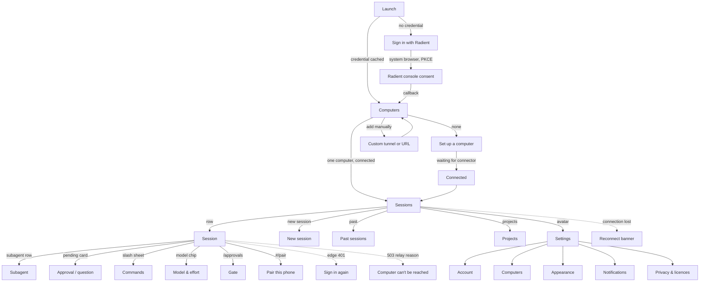

# Target native flows

Step-by-step specs for the Local Operator mobile app: every state a screen can be
in, what the user can do, and the *intent* of the copy (exact strings are the
designer's to finalise; the intent and the facts each string must carry are
fixed here). Flows are ordered as a user meets them. `F-n` ids are referenced by
`principles.md` and by the audit harness; each flow's governing principles are
listed in §0's table so the back-link is real in both directions.

**Citation ref.** Every line citation in this document is against the *committed*
ref, **by SHA**: `~/local-operator` at `5bfff4a61` (2026-09-29) and
`~/radient-ml/agent-server` at `dcafe852349ebad3421010b06cfc36e61ac9c5bf`. Read them
with `git show 5bfff4a61:<path> | sed -n '<line>p'`.

**Do not read them with `git show origin/main:<path>`.** `origin/main` has moved
past this pin on both repos — `~/local-operator` is at `c2bd09ea0` as this is
written — and the same file differs by tens of lines between the two: `store.ts`'s
`DRAFT_PREFIX` is L405 at the pin and L433 on today's `main`, which is precisely
the error round 3 of the review caught in this document. A moving ref makes every
number in a review un-reproducible; a SHA does not. The working tree is a third
state again and is mid-edit by other sessions — see `AGENTS.md`, "Read the
committed ref, not the working tree". Where a number is expected to move, the text
says so.

Conventions used below:

- **State:** every non-happy state is named. A flow is not specified until its
  loading, empty, error and degraded states are.
- **Copy intent:** what the sentence must convey, in the Local Operator voice
  (`~/local-operator-site/docs/design-kit/voice.md`): say what happens and on
  whose machine, no jargon noun, no adjective doing a verb's job, one idea per
  sentence.
- **Facts available:** the relay/edge facts each screen may state, so copy can be
  specific instead of generic. Sources: `docs/mobile.md`, `docs/tunnels.md`,
  `local_operator/tunnels/gateway.py` (`RELAY_DETAIL`), the Radient edge
  (`edge/tunnel-worker/src/index.ts`) and control plane
  (`internal/tunnels/{service,model}.go`).

## 0. Navigation map



Screen names (final): **Computers** (host list), **Sessions** (session list),
**Session**, **Subagent**, **New session**, **Past sessions**, **Projects**,
**Settings**, **Set up a computer**, **Sign in**.

### Flow → principle index

The principles each flow is written to satisfy (`principles.md`). This is the
half of the link the rubric cannot make on its own: a flow is where a principle
becomes a screen.

| Flow | Screen(s) | Principles |
|---|---|---|
| F-1 sign-in and discovery | Sign in, Computers | P-1, P-5, P-6, P-10, P-12 |
| F-2 no tunnel yet | Set up a computer | P-2, P-5, P-6, P-10 |
| F-3 custom URL + password | Set up a computer | P-5, P-6, P-8, P-12 |
| F-4 computers and the switcher | Computers, Settings › Computers | P-3, P-5, P-10 |
| F-5 session list | Sessions | P-1, P-3, P-5, P-9 |
| F-6 session view | Session, sheets, pending card | P-1, P-2, P-4, P-7, P-8, P-9 |
| F-7 subagents | Subagent | P-3, P-10 |
| F-8 new / past / projects | New session, Past sessions, Projects | P-1, P-2, P-10 |
| F-9 connection states | all | P-4, P-5, P-6, P-9 |
| F-10 settings, demo mode | Settings | P-8, P-10, P-11, P-12 |

## 1. F-1 First run → signed in → connected

Steps:

1. **Launch, no credential.** Show the brand mark and one sentence about what
   the app is for. One primary action: *Sign in with Radient*. One secondary,
   smaller: *I have a tunnel address and password* (F-3). Nothing else.
   - *Copy intent:* name the account ("Radient") and what signing in does (finds
     your computers). No feature tour, no three-panel onboarding — the product
     reveals itself in the list.
2. **Sign in (system browser, never an in-app web view).**
   `ASWebAuthenticationSession` (iOS) / Chrome Custom Tabs (Android). PKCE S256,
   scope `openid profile email offline_access`, loopback or app-link callback.
   **Constraint:** Google/Microsoft sign-in is the console's only route, and
   embedded WebViews are refused by Google, so an embedded web view is not an
   option — this is why the flow is a browser sheet.
   - *States:* browser open / user cancels / callback received / callback fails.
   - *Copy on cancel:* "Sign-in was cancelled." + *Try again*. Never scold.
3. **Post-sign-in handshake.** Exchange the code, store the refresh token in the
   **keychain/keystore** (never in app storage), then discover tunnels
   (`GET /v1/tunnels` with the Bearer token).
   - *States:* discovering (brief) / one computer / several / none / discovery
     error. On error, do not dump a status code: "We couldn't check your
     computers just now." + *Retry* + *Use an address instead*.
4. **Zero computers** → F-2. **One or more** → F-4 Computers.
5. **Later launches:** cached credential + last computers → straight to
   Computers with the previous list rendered from cache (age shown if > 5 min,
   see F-4).

Copy intent for the button: it is an action on their account, so say what they
get: *Sign in with Radient* is right; "Continue with…", "Authorize", "Connect
account" are not.

## 2. F-2 No tunnel yet → create one on the computer → live wait → connected

This is the highest-leverage flow in the product: today a user who has signed in
but has no tunnel hits a dead end.

1. **Empty Computers screen.** Title *Set up a computer*. One paragraph: this
   app drives the Local Operator sessions on your own computer; the computer has
   to run a connector and stay awake. *Copy intent:* "your computer", "stays
   awake and connected", "your code stays on it". No metaphor, and the word
   "tunnel" does not appear in the first sentence.
2. **Three ways, and the commands are not interchangeable.** Getting this wrong
   is the one way F-2 can ship copy that errors for exactly the user it exists to
   rescue: `lop tunnel connect` **attaches a tunnel that already exists** and
   refuses with `Supply the tunnel ID shown in the Radient console.` when there
   is none (`local_operator/tunnels/cli.py` L519-521 at the pinned SHA). So the
   screen offers creation, attachment, and *neither* as three distinct routes:

   - **(a) Create one on the computer — recommended, no console needed.**
     In a terminal:
     ```sh
     lop login radient          # once, if not already signed in
     lop tunnel create          # + --accept-monthly-price <quoted USD> if activation is required
     lop tunnel install         # installs the connector service
     ```
     In the TUI, the same lifecycle in two commands: `/mobile billing` shows the
     quote, eligibility and balance; `/mobile enable <amount>` then creates the
     tunnel and installs its connector. (`mobile_action` maps `enable` to
     `tunnel create` when no config exists, or `tunnel configure --enable` when
     one does, followed by `tunnel install` — `cli.py` L729-745 at
     the pinned SHA.)

     **The app composes the exact command.** The owner token can read
     `GET /v1/tunnels/billing` (`eligible`, `monthly_price_usd`, `balance_usd`,
     `amount_due_usd` — `internal/tunnels/service.go` L24-31 at that repo's
     the pinned SHA), so the copy block
     carries the *real* quoted amount instead of a placeholder. It has to: both
     `--accept-monthly-price` and `/mobile enable` take the quoted number, and a
     user who has not run the billing step has no way to know it.
   - **(b) Attach a tunnel that already exists** (created in the Radient
     console): `lop tunnel connect <tunnel-id>`, with the id the console shows.
     This is the **only** path where `connect` is the right command.
   - **(c) "I already have a tunnel address"** — a non-Radient tunnel, or a plain
     URL and the relay password → F-3.
3. **Live wait for the connector — and it waits on things it can actually see.**
   The screen switches to the waiting state as soon as (a)'s command is copied.
   It observes two signals, in this order, and names whichever it has:

   1. **The tunnel's row in the control plane** — `GET /v1/tunnels` with the
      owner token. `status` moves `pending` (`internal/tunnels/service.go` L310)
      → `active` (L476), through `revoking` (L447), `reconciling` (L453), `error`
      (L468), `deleted` (L474), `disabled` (L478) and `suspended` (L480) — all at
      that repo's pinned `dcafe85`, whose working tree is **8 lines behind it**
      and is the only place these numbers are true — and `billing` fills in.
   2. **The host answering through the relay** — an `https://<host>/healthz`
      request returns the relay's health JSON once the connector is up and
      forwarding. The daemon's health gate is *deliberately unauthenticated*
      (`docs/mobile.md` L115-131 at the pinned SHA), which is what makes this a
      usable signal rather than another credential dance.

   What the phone **cannot** see, and must not pretend to: the connector's own
   local state (`running` / `parked`, `lop tunnel status`) lives on the computer,
   and the console's word for it is not exposed to the owner-token API. So every
   waiting line names something *observed* — "Radient has the tunnel", "Your
   computer answered" — never "setting up…".

   - *States, named for the rubric:* `W1` waiting (nothing observed yet) · `W2`
     **tunnel active, host not answering yet** (the common middle state: the row
     is `active` before the connector finishes installing) · `W3` connected
     (health answered) · `W4` timed out (2-3 min with nothing) · `W5` waiting
     while the app is backgrounded (pause polling, resume on foreground).
   - *Waiting copy:* "Setting up `<computer name>`…" plus a live line naming the
     last thing observed: `W1` "Nothing yet — run the command above", `W2`
     "Radient has the tunnel. Waiting for your computer.", `W3` "Ready." — the
     backticked placeholder is a slot the app fills with the computer's name, not
     literal copy.
   - *Success:* flip to the Computers list with the new computer, then straight
     into F-4's connected state (if it is the first computer, go to F-5).
   - *Timeout copy:* keep the command visible (the user may still be typing it),
     add "We haven't seen your computer yet. It needs to stay awake and online."
     and a *Check again* button.
4. **Billing / eligibility gating.** The control plane reports connector-level
   facts we can surface honestly (`internal/tunnels/service.go` billing status:
   `active`, `eligible`, `monthly_price_usd`, `balance_usd`, `amount_due_usd`;
   tunnel status: `pending`, `active`, `disabled`, `suspended`, `revoking`,
   `reconciling`, `error`, `deleted`):
   - `pending`: "Almost ready — finish setting up in the Radient console." +
     *Open console*.
   - `suspended` / balance at the floor: state the amount due and the one
     action: "This tunnel is suspended. Add `<amount>` of credit in the Radient
     console to turn remote access back on." + *Open console*. **Never** say
     "billing error"; **never** activate anything silently (matches
     `docs/tunnels.md`: "Billing is never activated silently").
   - `disabled`: "Remote access is switched off for this tunnel." + *Open
     console*.
   - `error`: "Radient couldn't finish setting this tunnel up." + *Open console*.
   - Not eligible (no positive credit at first setup): say what is missing and
     that the console is where credit lives; do not offer a purchase inside the
     app (store rules make in-app billing of a third-party service a separate,
     large decision).
5. **Never leave the user unable to continue.** Every failure state keeps: the
   command, *Copy*, *I already have a tunnel*, and *Sign out*.

## 3. F-3 Own tunnel (self-hosted) — the guided set-up

**Revised 2026-09-30.** The flow id is unchanged because the destination is the
same one; what changed is that this is a *route* and not a form. The app works
with no Radient account at all, and a reader who already runs a tunnel should
never have to work that out from a bare "address and password" field.

1. **Entry points — and the path is NAMED where the choice is made.**
   - First run → *Set up your own tunnel* (secondary to Radient, never hidden).
   - `/tunnels` with no computer yet → two clearly-labelled paths, in order:
     **Connect with Radient** (recommended; a private authenticated URL and
     nothing to configure — the honest reason it is recommended) and **Set up
     your own tunnel** (the advanced path for a computer you expose yourself,
     with **no Radient account anywhere in its copy**). With a computer already
     chosen, the switcher keeps the same entry as a quiet action under the list.
   - Settings → Your own tunnel → *Set up* / *Edit*.
   - `/custom` remains a working alias of `/own-tunnel`, so every older link and
     refusal surface still lands on the guided flow rather than a thinner one.
2. **Step 1 — on the computer.** The exact commands, each copyable, with what to
   expect from it: `lop mobile install` (macOS: supervised, generates the portal
   password into the keychain) or `LOP_MOBILE_PASSWORD=… lop mobile serve`
   (foreground, serves **127.0.0.1:4098**, loopback only), `lop mobile status`,
   and `lop mobile password` to set or rotate the portal password. There is no
   bare `lop mobile` — the CLI has no such command and the copy does not invent
   one.
3. **Step 2 — publish it.** `cloudflared tunnel --url http://127.0.0.1:4098` and
   `ngrok http 4098` as the two named examples, plus the general rule: any tunnel
   that forwards a public HTTPS URL to `127.0.0.1:4098` works.
4. **Step 3 — address + password.** `https://` is the preferred form and gets no
   warning. A plain `http://` address is refused with the reason, not just
   "invalid", and is reachable only through an explicit opt-in that states the
   exposure; it is never silently allowed or downgraded. The password is
   paste-friendly, masked, and never logged; there is **no Name field** — the
   address is the identity, and the switcher shows the hostname.
5. **Step 4 — test before saving.** A real request through the reader's tunnel,
   and a verdict that says what happened **in the taxonomy's sentences, never a
   status code**:
   - *Connected* — "Connected — you can see N sessions" (the real count).
   - *Wrong password* — that password was not accepted; retry.
   - *403* — the tunnel refused the app: allow it through any access policy or
     login page in front, and check the tunnel forwards straight to the relay
     (the relay also refuses requests it did not send; `docs/relay/contract.md`
     § 1.2).
   - *503 / 502* — the tunnel exists and nothing healthy is behind it, with the
     gateway's own sentence and `lop mobile status` as the remedy.
   - *TLS / certificate* — named as such, because a self-signed edge is the
     common failure and "unreachable" would send the reader to check DNS.
   - *DNS / unreachable*, and *timeout*.
   Only a `Connected` verdict enables saving: a saved-but-unanswered tunnel is a
   phone showing an empty list with nothing to explain it.
6. **Saved → F-4**, and it appears in the switcher beside Radient computers. The
   address and password are kept in the platform's secure store (keychain /
   keystore; `src/connection/storage.ts` owns the record), never in plain app
   storage. A cold start **resumes** a saved tunnel without asking again; a
   tunnel saved without a remembered password is loaded but not dialled, and the
   screen asks for the password. Settings offers *Edit*, *Test again* (one tap,
   on the stored values) and *Remove*; removal forgets that one item and leaves
   the Radient login alone.
7. **No Radient language on this path**: no account, no credits, no billing, no
   tunnel-session minting, and nothing here is behind a Radient credential.
8. **Edge case:** a password rotation on the computer invalidates the relay
   cookie. A 401 from a custom route returns to this flow with the address
   prefilled — it must never sign the reader out of everything.

## 4. F-4 Computers: discovery, connection and the switcher

1. **List.** One row per computer: name, hostname as secondary text, state chip,
   and last-seen when not connected. Sort: connected first, then last seen.
   - *States per row:* **connected** (accent dot) / **asleep or offline**
     (muted, with "last seen 2 h ago") / **needs sign-in** / **suspended**
     (billing) / **checking** (spinner) / **unknown**.
   - *Facts for the tooltip/subtitle:* tunnel `status` and `updated_at`,
     `hostname`, harness name. Never show a raw tunnel id.
2. **Auto-connect** to the last used computer on launch when it is connected, so
   a single-computer user never sees this screen after the first run.
3. **Switcher** (the app's answer to "which computer" — R3): reachable from the
   Sessions header (title becomes the computer name with a chevron) and from
   Settings → Computers. Switching keeps per-computer session caches, so
   switching back is instant.
4. **Empty:** F-2. **Error:** per-row retry, plus a screen-level "Couldn't reach
   Radient." with the cached list still shown.
5. **Add / remove:** *Add a computer* → F-2 if signed in, F-1 if not. Remove →
   confirm once, explain that it removes the phone from the list and does not
   touch the computer.

## 5. F-5 Sessions (the list)

1. **Header:** computer name (tap = switcher), search icon, avatar (Settings).
2. **Sections:** Pinned · Active · Previous. A session row shows: name, working
   directory (truncated from the left, since the tail identifies it), model
   label, and **one** state mark chosen by this precedence (matching the web
   client's documented ranking so the two surfaces never disagree):
   **needs a decision** › **running** › **new activity** › **ended** ›
   **degraded**.
   - *Decision state:* word `approval` / `question` in danger ink plus a dot.
   - *Running:* shimmer on the name (never a spinner beside it).
   - *New:* accent word `new`, cleared on open.
   - *Ended:* muted, with resume offered inside the session.
   - *Degraded:* muted "not answering" (see §9).
3. **Attention badges:** count of sessions needing a decision, on the header
   and as the app icon badge (§10).
4. **Search:** server-side search of live sessions and past conversations; an
   empty field shows recents; keyboard opens with the field (search is a
   first-class action on a phone).
5. **Row actions:** swipe **left** = pin/unpin (with the same durable pin store
   the TUI's F10 and the desktop use, so the surfaces agree); swipe **right** =
   archive/end; long-press = context menu. *No pinning hidden behind a
   long-press with a permanent hint line* (R7) — a first-run coach mark teaches
   the swipe once, then never again.
6. **Footer:** *New session* primary; *Past* and *Projects* secondary.
7. **States:** loading (skeleton rows) / empty (see below) / one session /
   many / all ended / offline (banner, cached rows, "last updated") / error.
   - *Empty copy intent:* two sentences, and an action: "No sessions on
     `<computer>` yet." + "Start one and it will appear here." + *New session*.
     If the computer has never had one, add the one-line hint about what a
     session is.
8. **Pull to refresh** re-reads the list; the SSE stream keeps it live while
   open.

## 6. F-6 Session view

Composition top to bottom: header · status strip (spend/context when the daemon
reports them) · transcript · todos · subagents · pending card · composer.

States to specify for every element below: **loading** (history fetch),
**live**, **streaming**, **ended**, **degraded**, **offline with cache**,
**error**.

1. **Header:** back · name (max 1 line, truncate middle) · computer chip if more
   than one computer is configured · overflow menu (pin, rename, move directory,
   archive, fork, delete, *approvals*, *pair this phone*, subagent list).
   **At large text sizes the name must keep at least ~8 characters** — today's
   web client collapses it to one glyph at 200 % (R14).
2. **Transcript rows:** user turn (accent-bordered block, image thumbnails
   inline), assistant markdown (code blocks horizontally scrollable, copy on tap),
   tool row (one line: state glyph, tool name, compact args summary, diff
   `+n -m`, elapsed; tap expands args/output/diff), notice rows (severity ink),
   steer receipt, compaction rung, peer message (cross-session card with a ↔
   glyph and the sender's name), reasoning (transient, never persisted).
   - *Streaming:* a working line above the composer showing what the agent is
     doing (already in the codebase) and the elapsed time; the transcript
     auto-follows only when the user is at the tail (the web client learned this
     the hard way — see PR #1784's U27/U28).
3. **Todos:** collapsed header `todos n/m` with a phase-aware panel; open items
   first. Never pushes the composer off screen (v1 rule: at most one of
   todos/subagents expands by default).
4. **Subagents:** collapsed header `subagents n/m running` with queued and
   failed counts; expanding lists children; tapping one opens F-7.
5. **Pending card:** unchanged in spirit from the web client (see
   `current-relay-audit.md` §2.1) — pinned, capped, controls always visible,
   `1 of N` badge, masked field for secrets, and now with a **labelled**
   remember choice that names its scope ("Always allow `bash` in this
   session").
6. **Composer:** multiline field (44 pt minimum), attach (photo library /
   camera / files), model + effort chips, send/steer/stop as one morphing
   primary control with an explicit label, and a **queue indicator** when a
   queued message is waiting to be delivered after the current turn.
   - *Never lose a typed instruction:* drafts persist per session and survive
     app kill; an ambiguously-delivered instruction keeps its identity and
     offers *Retry* (the retry-envelope contract, reproduced natively).
   - *Voice:* dictation on the composer; transcript appended to the draft, not
     sent automatically.
7. **Model / effort sheet:** list from `/api/models`, grouped by provider, with
   connected/disconnected state, ranked as the daemon ranks; effort as discrete
   rungs from the projection's ladder. Selected state visible on the chips.
8. **Slash commands:** the list from `/api/commands` with fuzzy filtering, each
   row showing the command and its argument hint; argument-taking commands
   hand back to the composer with a trailing space.
9. **Attachments:** images sent as base64 blocks (payload already supported);
   metadata (size, encoder result) visible before send; oversize images are
   re-encoded (the web client's canvas path) with a visible note.
10. **Ended session:** a strip offering *Resume*, explaining where it reopens
    ("in its saved folder"), and the transcript beneath. Only **one** resume
    affordance (PR #1784's U15 fixed two that disagreed).
11. **Exit:** back preserves scroll position and draft.

## 7. F-7 Subagent view

Full-screen child transcript with a back-to-parent crumb; header states the
parent's name and the child's job id (short), a state chip (running / completed
/ failed / cancelled / parked), and the child's own spend/context when known.
Long children page their history (the `history` endpoint) with the same
auto-follow rule. Failed children show the failure reason above the transcript,
not only in the parent's count.

## 8. F-8 New session, past sessions, projects

- **New session:** working directory (Home, recents, free-text path with
  validation), model picker, optional name, optional prompt, and *Start*.
  - *States:* loading directories / directory not writable or missing (stating
    which) / starting (spinner on the button, form disabled) / start refused
    (reason in the user's words, form preserved).
  - *Copy intent for a refused start:* name the folder and the reason: "That
    folder doesn't exist on `<computer>`."
  - A session started from the phone is supervised by the daemon and appears in
    the list immediately with a "starting" state.
- **Past sessions:** list of ended conversations with name, folder, last message
  time; search across them; *Resume* per row with `opening…` inline state and a
  refusal sentence that is recoverable ("This session is no longer saved." never
  leaks a session id — PR #1784's U26).
- **Projects:** read-mostly: list, detail (progress, milestones with toggles,
  linked sessions), create, delete. Timeline is out of scope (the web client's
  own note). Editing milestones from the phone is worth having because it is the
  one project operation a decision makes urgent.

## 9. F-9 Connection states: rotation, loss, re-auth, refusals

Seven named states. The names matter: the audit rubric scores *these* ids, so a
harness failure can say which state it saw without a paragraph of prose. The
first one is the one everybody gets wrong.

| id | State | Trigger | What the user sees | Typical duration |
|---|---|---|---|---|
| `C1` | **Rotation** | the gateway's own 60 s stream cut | **nothing at all** | invisible |
| `C2` | Reconnecting | a transport error, or no frame after a rotation | one inline line, resolved in seconds; never a modal, never a flash for `C1` | < 5 s |
| `C3` | Degraded | no chunk past `KEEPALIVE_GRACE_S` (75 s — derived below) on an open stream, or a snapshot that is old | "Not answering — last update `<n>`s ago", with the last snapshot still readable | until answered |
| `C4` | Phone offline | no network route at all | "Offline. Messages will send when you're back." | until online |
| `C5` | Re-auth | edge 401 + `X-Radient-Login` | "Your Radient session expired. Sign in to reconnect to `<computer>`." + one button | until signed in |
| `C6` | Relay refusal | 503 + a typed `RELAY_DETAIL` reason | the gateway's own sentence + one remedy | cause-dependent |
| `C7` | Computer asleep / connector stopped | the host stops answering; the control plane still lists the tunnel | the computer's card says it is not answering, with its last-seen time | until the computer returns |

### `C1` — the 60 s rotation is normal, and must be invisible

The gateway deliberately ends every relayed SSE response at
`MAX_STREAM_SECONDS = 60` (`local_operator/tunnels/gateway.py` L34 at
the pinned SHA; the timeout at L678). On the Radient route that orderly close
arrives **once a minute, forever**. Its consequences are the whole of this
section:

- **The client reconnects immediately on an orderly close.** No backoff, no
  user-visible state, and no "reconnecting" flash — a one-minute flicker on a
  long turn is worse than no indicator at all, because it teaches the user to
  ignore the indicator that matters.
- **Every reconnect re-syncs from a fresh snapshot**, and a stale repaint is
dropped rather than merged: the projection's `version` orders epochs
  monotonically across process replacements (`docs/mobile.md` L257-294 at
  the pinned SHA). The client never merges deltas — that is the phone leg's own
  contract: "The phone leg is HTTP + SSE, never WebSocket … Every state push is a
  snapshot/repaint, not a delta" (`docs/mobile.md` L37-40).
- **Only a *failed* reconnect is a state.** `C2` is entered when the transport
  errors, or when a rotation's replacement does not produce a snapshot, and it is
  left the moment one lands.
- **A cut is not a signal.** `current-relay-audit.md` R5 states the rule the
  current client already follows; the native client inherits it.

### The grace window, derived rather than guessed

`C3` is *absence*: no chunk at all on an open stream for longer than the grace
window. The window has one job — be longer than the slowest silence a healthy
connection can produce — so the cadences around this leg are read off the code,
never remembered:

| what | cadence | where |
|---|---|---|
| the relay daemon's SSE keepalive — **the phone leg's own silence budget** | 25 s (`SSE_KEEPALIVE_S = 25.0`, documented as "under the 60 s idle cutoff of common proxies") | `mobile/daemon.py` L104-105 |
| the encrypted link's keepalive — a *different* transport (daemon ↔ runtime/mesh), not the phone leg | 30 s (`KEEPALIVE_S = 30.0`), with a 120 s idle close (`LINK_IDLE_S`) | `network/wire.py` L67-69 |
| the gateway's stream cut — the **rotation**, `C1` | 60 s (`MAX_STREAM_SECONDS`, applied as an `asyncio.timeout` around the upstream read) | `tunnels/gateway.py` L34, L678 |

**The gateway emits no keepalive of its own.** It forwards the upstream's bytes
(`stream()`, `gateway.py` L673-686), and its single mention of the word is a
comment about the *revoke* path's latency (`L676`, "keepalives are 15s").

**That 15 s is real — it just belongs to another leg.** Local Operator does define
a 15 s heartbeat, twice, for the harness: `HEARTBEAT_INTERVAL_S = 15.0` in
`session/runtime/types.py` L416 (re-exported at `mobile/types.py` L59 and used as
the link's `HEARTBEAT_S` at `network/relay.py` L211), and again in
`server/utils/sse.py` L70 under the comment *"Keepalive interval. Matches
Minerva's 15s"*, emitted on the harness's own SSE route as a **dispatchable**
keepalive frame (`server/routes/sse.py` L189, whose comment reads *"A dispatchable
keepalive, not a comment: proxies count it as traffic AND the client's stall
detector can re-arm on it"*). The gateway resolves its upstream as the local
harness (`gateway.py` L652, L699), so L676's number has a real referent and is
plausibly accurate about the leg it names.

**It is not the phone leg, and it is not the window's basis.** The slowest healthy
silence on the phone leg is the daemon's 25 s (`SSE_KEEPALIVE_S`), and 75 s clears
15 s, 25 s and 30 s alike. So the rule stands — derive the window from the cadence
of the leg it watches, never from a number found in a comment about another one —
but the reason is *which surface emits what*, not that a 15 s keepalive does not
exist.

**The rule, then the number.** The window must be **strictly greater than the
slowest cadence that must not trip it**, times a margin. An absence window
*shorter* than a healthy cadence is the flapping bug this section exists to
prevent: `C3` appears, the next keepalive clears it, `C3` re-appears, and the user
learns to ignore the indicator that matters. With the slowest cadence on the leg
at 25 s — 30 s if the link's cadence is counted as a conservative bound — a 2×
margin puts the floor at 50-60 s, so:

> **`KEEPALIVE_GRACE_S = 75`.** 3× the daemon's cadence, 2.5× the link's, and
deliberately **not** a multiple of the 60 s rotation, so a harness reading can
tell a rotation from silence without arithmetic. One constant, defined beside the
cadence it derives from, with the table above it as its derivation.

**The window is the last resort, not the detection path.** Every common failure
presents in seconds, and none of them waits for it:

| failure | how it presents | how fast |
|---|---|---|
| the 60 s rotation | the stream *closes* — `C1`: reconnect, then re-sync from a fresh snapshot | immediate |
| a rotation whose replacement produces nothing | `C2`, from the reconnect's own deadline (pick ~5 s; state it in code) | ~5 s |
| a transport error (refused, TLS, DNS, reset) | `C2`, from the event itself | immediate |
| a silent-but-open stream — the pathological case the window exists for | `C3`, from the window | 75 s |

Marking *any* SSE error as loss is the bug this section exists to prevent: an
orderly close is `C1`, and only silence or a transport failure is a fault.

### `C4` — the phone lost the network

- Slipped banner under the header on the Session screen, and a muted line in the
  Sessions list.
- **Copy intent:** say what will happen, not what broke. The draft and the queue
  are preserved; the send button stays and explains the queue behaviour on tap.

### `C5` — the Radient session expired (edge 401 / `X-Radient-Login`)

The edge answers HTML `GET`s with a 303 to the login page and everything else
with 401 + `X-Radient-Login: /_radient/login`. A native app must not follow a
browser redirect: on 401 carrying that header, present *Sign in again* (system
browser, the same PKCE flow, silent when the refresh token is still valid — the
refresh token is opaque, 30-day absolute and not rotated, so this should be
rare).

- *Copy:* "Your Radient session expired. Sign in to reconnect to `<computer>`."
  One button. After success, return to exactly the screen the user was on, with
  the transcript intact.
- **Never** clear drafts on an auth blip; only on an explicit sign-out or an
  identity change (the web client's rule, kept — `api.ts` L64-70 at the pinned
  SHA).

### `C6` — the computer can't be reached (503 with a typed reason)

The gateway already ships one honest sentence per cause (`RELAY_DETAIL` in
`gateway.py` L106 at the pinned SHA): `control_plane_unreachable`,
`authorization_refused`, `tunnel_not_authorized`, `authorization_lease_pending`,
`login_required`. The app **renders those sentences verbatim** — they are the
product's own vocabulary, already reviewed — and adds a *Check again* button,
plus *Open console* where the remedy lives there.

- **Invariant:** never show a spinner forever. Every request has a deadline and a
  stated failure.

### `C3` / `C7` — degraded vs asleep, and vs ended

- *Degraded session* (daemon up, the session's own socket not answering): the row
  and the header say "not answering". The session stays listed, its history stays
  readable, and it is explicitly **not** the same as ended.
- *Computer asleep / connector stopped* (`C7`): the computer's card says so, with
  last-seen; sessions stay visible from cache, marked as not live.
- *Ended session*: distinct copy, offering resume.


## 10. F-10 Settings

| Section | Contents |
|---|---|
| Account | Radient account (email, sign out, delete account link), plus the local app-lock toggle (biometric/PIN) |
| Computers | F-4's list + add/remove, per-computer: name, hostname, last seen, state, *Open console*, *Remove* |
| Notifications | master toggle, "when a session needs a decision", "when a turn finishes", quiet hours, and the **"don't notify while I'm at the computer"** rule (the desktop/phone presence idea; see principles 8) |
| Appearance | System / Light / Dark, plus a small accent choice; theme set is deliberately reduced from the web client's 31 palettes (R19) |
| Sessions | default model, default working directory, keep-awake reminder for the computer |
| Privacy | what leaves the phone (nothing but your instructions and the relay's frames), what is stored locally (drafts, caches, tokens), *Clear local data* |
| Licences | open-source licences (MIT for this app) and the third-party list |
| About | version, build, *What's new*, diagnostics (copy a redacted log), support link |

**Delete account (store requirement).** App Store Review Guideline 5.1.1(v)
requires that an app supporting account creation also offers account deletion
*in the app* — here the account is the Radient account, so Settings must link to
the deletion path and say plainly where it happens (the console) with a short
explanation of what is deleted. This is a launch blocker, not a nicety.

**Demo mode.** App review needs to see the whole app without the reviewer's own
computer. Ship a demo mode reachable from the first screen ("Explore a demo"),
which runs against **bundled fixture data** (no network, no credentials) shaped
like a real relay response: several sessions, one streaming, one waiting on an
approval, one ended, a subagent fan-out, spend/context readings. It must be
explicitly labelled, must not pretend to send anything, and must be excluded from
real network paths. (Store guidelines: a demo account or a fully-featured demo
mode; the relay cannot offer a hosted demo account, so demo mode is the only
honest option.)

## 11. Patterns that apply to every screen

- **Loading:** skeletons that match the final layout; never a bare spinner page.
- **Empty:** one sentence of what this screen is for + one action.
- **Error:** what happened, on whose machine, and one action; never a status code
  alone.
- **Refresh:** pull-to-refresh everywhere there is a list; SSE keeps it live.
- **Interruptions:** every modal sheet is dismissible by swipe-down and by the
  Android back gesture; the composer draft survives all of it.
- **Deep links:** `localoperator://s/<id>` opens a session; notification taps
  land there. Universal links for shareable session URLs are a v1.1 item.
- **One-handed reach:** primary actions live in the bottom third; nothing
  destructive lives under the top-right corner alone.

## 12. Open decisions (need an operator call)

- **D-1 - Push notifications.** The relay has no push service (an explicit v1
  non-goal). Options: (a) local notifications driven by a background fetch while
  the app is alive (cheap, no server, misses the case that matters most — the
  app is not running); (b) a small relay→APNs/FCM bridge in `lop mobile` (a
  service, a credential, and a privacy surface that must be designed); (c)
  deferred to v1.1 and shipped with (a) only. **Recommendation:** (c) for the
  first store release, with the notification settings screen present but honest
  that notifications only work while the app is running.
- **D-2 - Radient mobile OAuth client.** The phone needs either a loopback
  listener during sign-in (allowed today for `127.0.0.1`/`localhost`/`[::1]`
  with any port) or Radient registering a native client (private-use scheme per
  RFC 8252 §7.1, or an https app link). The loopback path works **today** with
  no Radient change, which is why F-1's step 2 assumes it. If Radient adds an
  app-link callback, the flow gets smoother (no listener) without changing the
  screen order.
- **D-3 - Multi-computer at launch.** F-4's switcher is specified, but if the
  first release targets single-computer users, the switcher can be a later
  addition; the *model* (per-computer caches, per-computer credentials) still
  has to exist from day one or it will be a rewrite.
